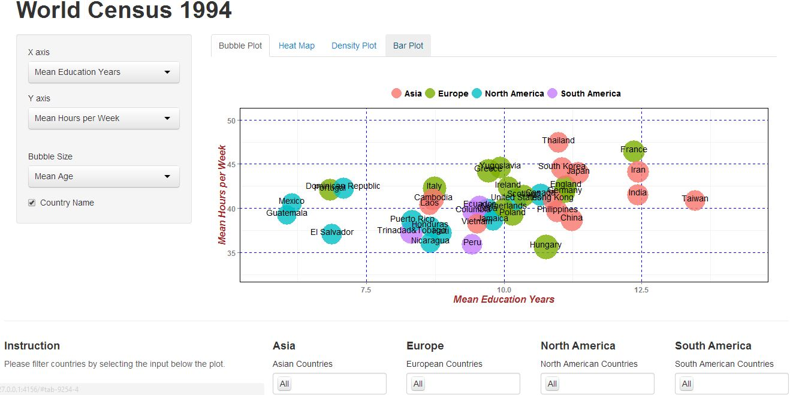
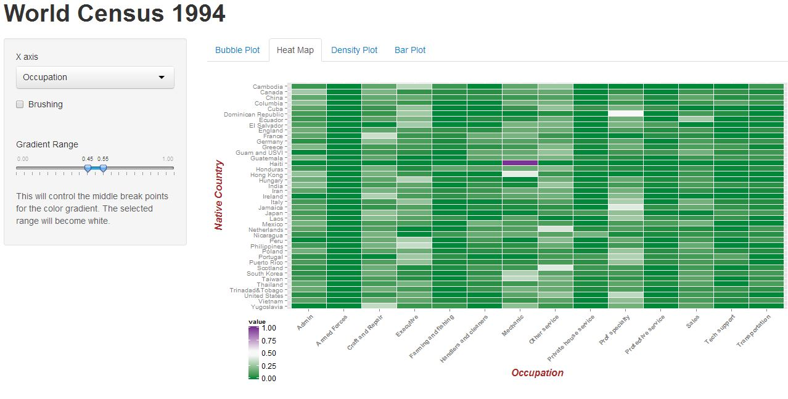
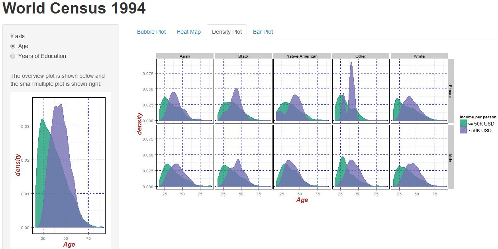
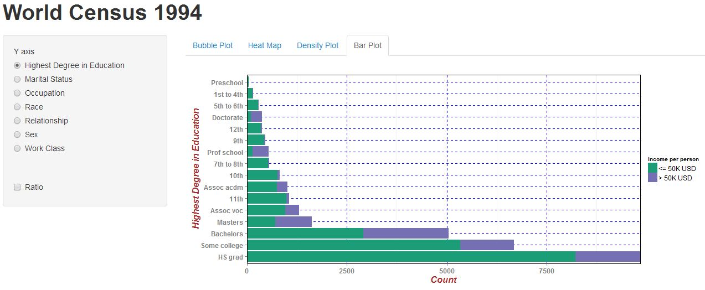
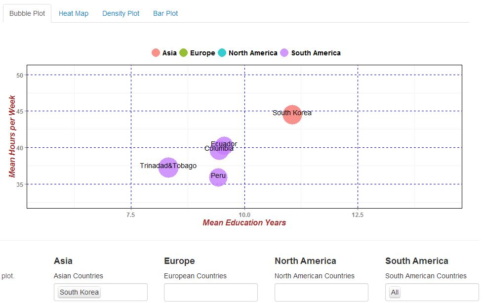
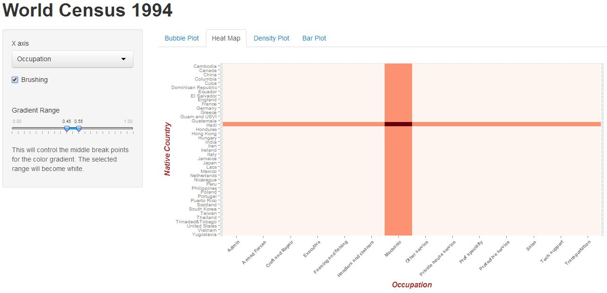
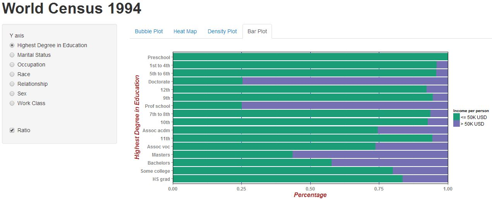

Final Project
==============================

| **Name**  | Kicho Yu  |
|----------:|:-------------|
| **Email** | kyu12@dons.usfca.edu |

## Instruction ##
The following packages must be installed prior to running this code:
- `ggplot2`
- `plyr` 
- `RColorBrewer` 
- `reshape2` 
- `scales` 

To run this code, please enter the following commands in R:

```
library(shiny)
runGitHub("msan622", "excelsky", subdir = "final-project")
```
This will start the `shiny` app. See below for details on how to interact with the visualization.  


## Discussion ##
### Data ###
The dataset is called `adult.data` from [UCI Machine Learning Repository](https://archive.ics.uci.edu/ml/datasets/Adult). It is also called '1994 Census database.'  

All the data cleaning is at `initiate.R`. It directly receives the original data from [UCI Machine Learning Repository](https://archive.ics.uci.edu/ml/datasets/Adult) and creates six csv files. All of them are generated and used in different plots. Some of them are long data from `reshape2::melt`

As of data munging, I deleted rows that have NA's. In this case, the NA was coded as ' ?' which is different from '?'. It took a decent time for me to figure out the difference. The original dataset has 32561 rows and there are still 30162 rows left after this munging. Thus, this deletion technique is easier and much advisable than other techniques such as converting NA's into a categorical variable, as the data is preserved by 92%.

I deleted a column called `fnlwgt`, because it is not easy to interprete and explain to other people. I changed the nomenclature in `levels()` of factors in order to increase the readability.


### Techniques ###

I have chosen the following visualization techniques for this project:

- Bubble Plot
- Heat Map
- Density Plot
- Bar Plot

#### Techniques 1: Bubble Plot ####
This plot uses `data2` from `initiate.R`. `data2` is generated from `plyr`

 


#### Techniques 2: Heat Map  ####
This

 


#### Techniques 3: Density Plot ####
This density plot shows the distinction in annual income: more than 50K USD versus less than or equal to 50K USD. In this specific screenshot, I ams shoing the income difference between ages. It is clear that the older the higher income. I am sure I can set up other numerical variables on the x-axis (instead of age) and make it interactive.

 


#### Techniques 4: Bar Plot ####
This

 


### Interactivity ###

#### Techniques 1: Bubble Plot ####
This

 

#### Techniques 2: Heat Map ####
This

 

#### Techniques 3: Density Plot ####
This

 

#### Techniques 4: Bar Plot ####
This

 


### Prototype Feedback ###


### Challenge ###
