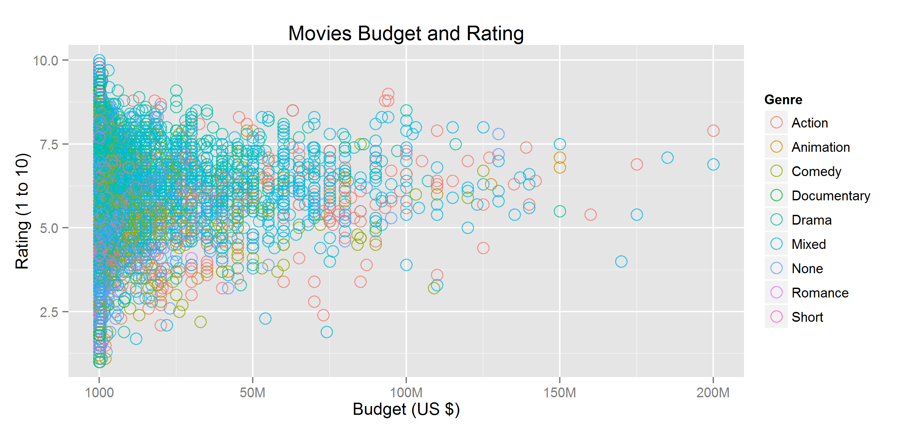
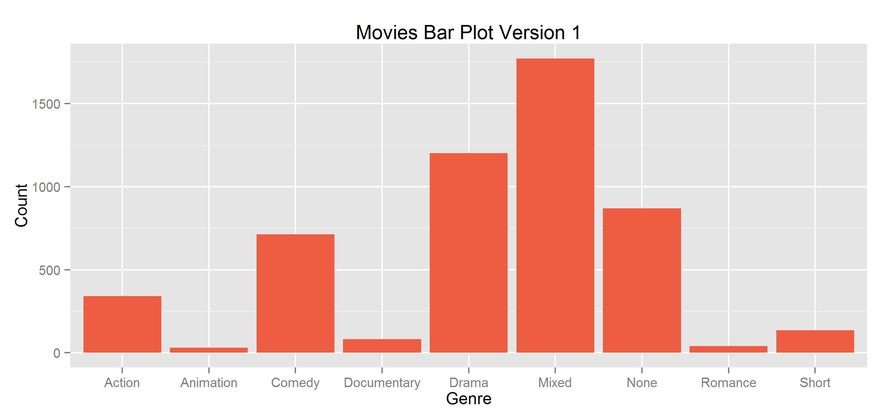
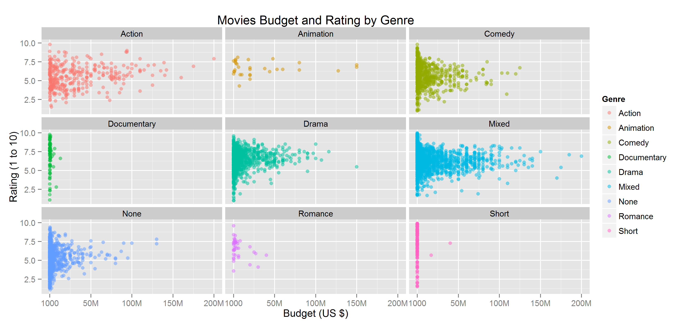
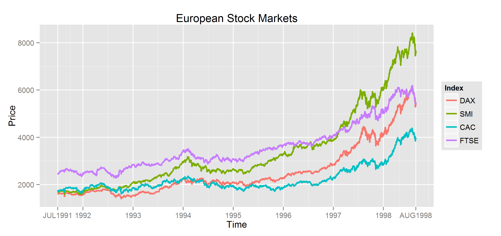

Homework 1: Basic Charts
==============================

| **Name**  | Kicho Yu  |
|----------:|:-------------|
| **Email** | kyu12@dons.usfca.edu |

## Instructions ##

The following packages must be installed prior to running this code:

- `devtools`
- `ggplot2`
- `plyr`
- `reshape2`
- `scales`

To run this code, please enter the following commands in R:

```
library(devtools)
source_url("https://raw.github.com/excelsky/msan622/template/homework1/622_Visualization_HAG1.R")
```

This will generate 4 images and some text output. See below for details.

## Discussion ##

First, I imported `movies` and `EuStockMarkets` and munged in accordance with the homework instruction.

- **Plot 1: Scatterplot.**  
I followed one of the color rules; never use more colors than can be stored in short-term
memory. So I colored by types of genre and have them all hollow circles with `size=4` and `alpha=3/4`. I found that the higher the `alpha` is, the darker the color is. The `size` option calibrates the width of a line. I changed tick marks. The larger the `size` is, the thicker the line is. The smallest budget is $1,000 and the largest is $200 million.  
  

- **Plot 2: Bar Chart.**  
I played around the `colors()` and chose `tomato2`. Actually, there are `tomato` through `tomato4`. The higher the number is, the darker the color is. In other words, `tomato` is the lightest and `tomato4` is the darkest. I created my own data set to create this plot. This bar chart shows the count of genres in the `movies` data set. `Mixed` is the most common genre in this data set, whereas `Animation` is the least common.     
  

- **Plot 3: Small Multiples.**  
Similar to what I did to `hw1-scatter.png`, I used 'alpha=1/2' so that I could see the overlays of points. I changed the tick marks like I did in the first plot. Overall, I think four are 3 clusters in these 9 genres. `Documentary` and `Short` have low budget and have all ranges of ratings. `Animation` have a wide range of budget but has only a certain range of ratings. `Romance` has relatively high ratings and its budget is generally low. Other genres have a full range of budget and ratings.  
  

- **Plot 4: Multi-Line Chart.**  
I created my own tick marks so that I could see the lower and upper limit of the timeline. Actually, these data are not very good, because the four different European stock market indices are in one `price` without considering the currency. I created a long data format to create this plot by using `reshape2::melt()`. Overall, Swiss SMI (Swiss Market Index) rises the most in the given period, whereas French CAC (Cotation Assistée en Continu) does the least.  
  
