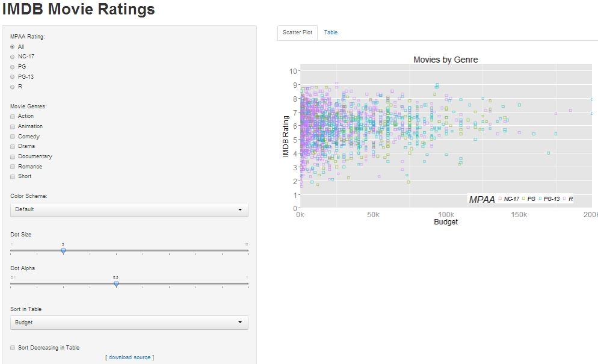

Homework 2: Interactivity
==============================

| **Name**  | Kicho Yu  |
|----------:|:-------------|
| **Email** | kyu12@dons.usfca.edu |

## Instructions ##

The following packages must be installed prior to running this code:

- `ggplot2`
- `shiny`
- `scale`

To run this code, please enter the following commands in R:

```
library(shiny)
shiny::runGitHub('msan622', 'excelsky', subdir='homework2')
```

This will start the `shiny` app. See below for details on how to interact with the visualization.

## Discussion ##

  

It is an interactivity of shiny and ggplot2 in R to see IMDB Movie Ratings. My display has two tables: a scatterplot and a table. A scatter plot is a comparison of budget versus IMDB ratings. A table shows a list of 1800 movies taken from the "movies" dataset in ggplot2.

A scatterplot has five main controls: MPAA Rating, Movies Genres, Color Scheme, Dot Size, and Dot Alpha.
MPAA Rating shows five ratings: NC-17, PG, PG-13, R, and all of them. It is using `radioButtons()` in order to select only one of them at a time.
Movies Genres shows all the seven genres in this `movies` data set. It is using `checkboxGroupInput()` in order to select multiple at once. The selection of all of them is equivalent to select nothing in this case.
Color Scheme has eight color schemes from [colorbrewer2.org](http://colorbrewer2.org)
Dot Size controls the size of dots in this scatter plot. The bigger the number, the bigger the dots are.
Dot Alpha controls the transparency of dots in this scatter plot. The higher the number, less transparent the dots are.

The table can be selected by clicking __Table__ tab on the right top of the screen. There are two main controls here: Sort in Table and Sort Decreasing in Table.
Sort in Table sorts a table in an order that users want. `selectInput ()` enables them to select among "Title", "Budget", "Genre", "Mpaa", "Length", "Rating", and "Year".
Sort Decreasing in Table is a checkbox to make the sort decreasing or not.


 
