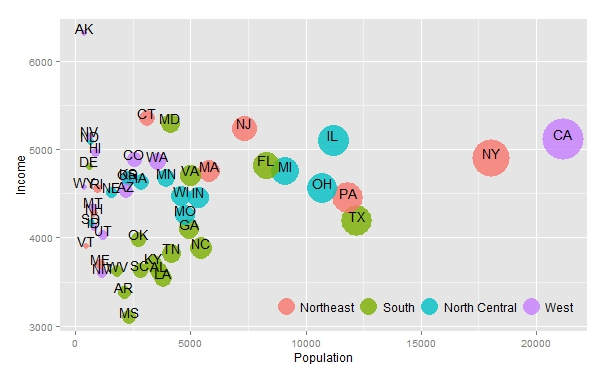
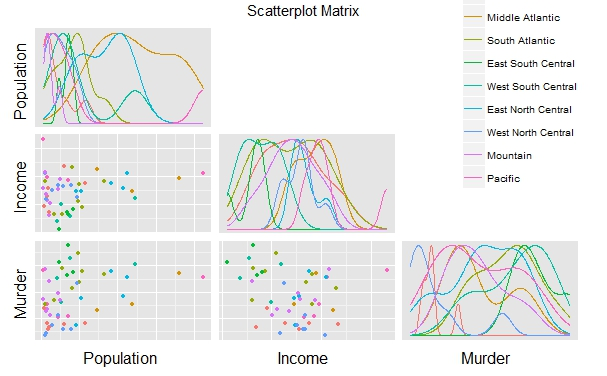
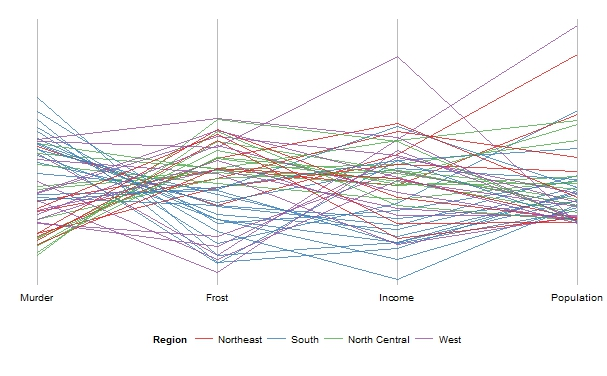
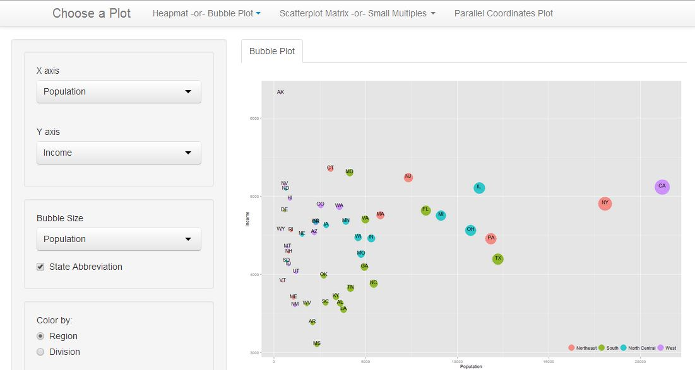
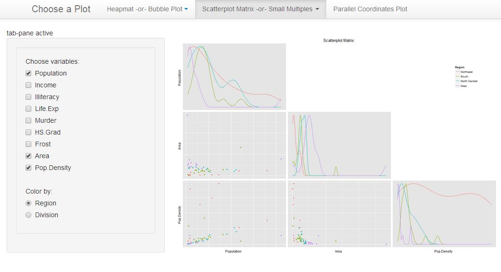
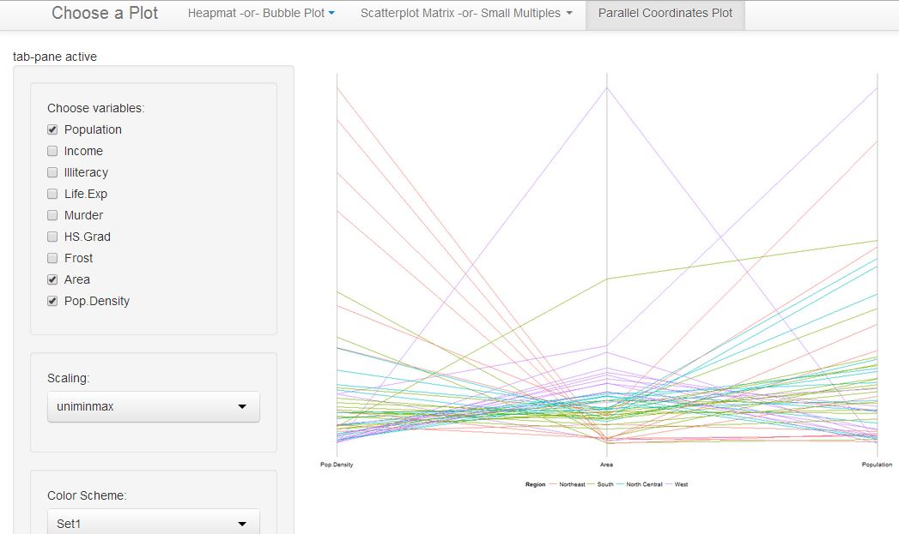

Homework 3: Multivariate
==============================

| **Name**  | Kicho Yu  |
|----------:|:-------------|
| **Email** | kyu12@dons.usfca.edu |

## Instructions ##

The following packages must be installed prior to running this code:

- `GGally`
- `ggplot2`
- `RColorBrewer`
- `scales`
- `shiny`


To run this code, please enter the following commands in R:

```
library(shiny)
shiny::runGitHub('msan622', 'excelsky', subdir='homework3')
```

This will start the `shiny` app. See below for details on how to interact with the visualization.

## Discussion ##

### Technique 1: Heatmap or Bubble Plot ###
#### Bubble Plot ####
I chose a bubble plot to use, because I think my data are better in this plot than heatmap. A bubble plot can show each 50 state in the United States as a discrete and distinct bubble, whereas a heatmap shows the 50 states continuously. Also, I think a bubble plot gives more freedom in location than a heatmap. Therefore, I think a readability is increased by selecting a bubble plot over a heatmap.  

#### Customization ####
1. The legend is placed on the bottom right. By being inside of the plot, it does not take an extra space, so it does not shrink the plot per se.  
2. The data are re-ordered in order to prevent the large bubbles from overlapping small bubbles.  
3. An annotation has been placed on the plot to display what the circles mean.  

  

### Technique 2: Scatterplot Matrix or Small Multiples ###
#### Scatterplot Matrix ####
I chose a scatterplot matrix to use, because I think my data are better in this plot than small multiple. A scatterplot matrix is a very great tool to show the relationships among multiple variables. It is an excellent visualization of  [Pearson correlation](http://en.wikipedia.org/wiki/Pearson_correlation_coefficient). Although a scatterplot matrix may not be the best tool as we learned in class with an example of [Anscombe's quartet](https://github.com/msan622/lectures/tree/master/Motivation), it is undeniable that this plot visually shows the correlation in the best way.    

#### Customization ####
1. The upper triangle is intentionally blank. The scatterplot matrix is symmetric, so using both an upper or a lower triangle is a redundancy.  
2. The legend is placed on the top right. It was not easy to generate a representative legend in `ggpairs()`, because it does not have an argument to do so, while it does for individual ones.
3. The diagonal plots are density plots, so they do not waste spaces.
  

### Technique 3: Parallel Coordinates Plot ###
Parallel coordinates plot is very good in comparing multiple variables in a bird-eye view. Different axis arrangements may be of interest.

#### Customization ####
1. You can customize the variables to compare.
2. You can select the color scheme depending on your eye restness.
  

## Interactivity ##
Overall, you can select three types of plots using the navigation bar. There are two drop-down tabs and a regular tab that you can select.

## Bubble Plot ##
You can choose variables for the x-axis and the y-axis. You can change the size and the color of bubbles. These selections are how you can __filter__ variables. You can either opt in or out the abbreviation of 50 states in the United States. I suggest to opt in for a readability.

  

## Scatterplot Matrix ##
You can choose and __filter__ the variables to compare. If less than two variables are selected, you can see a warning message. You can scale differently and the results are different. 

  

## Parallel Coordinates Plot ##
You can choose the variables to compare. You can select the color scheme depending on your eye restness. For some reason, the _Color By:_ is working as a __sorting__ in the order of column: increasing and decreasing.


  
