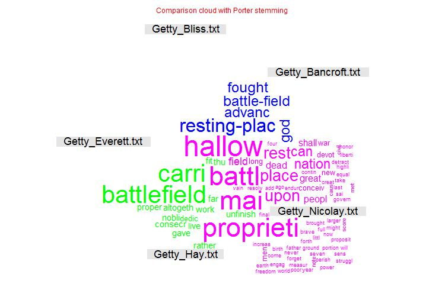
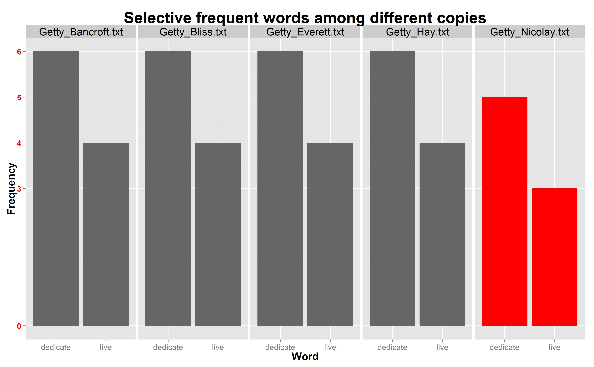
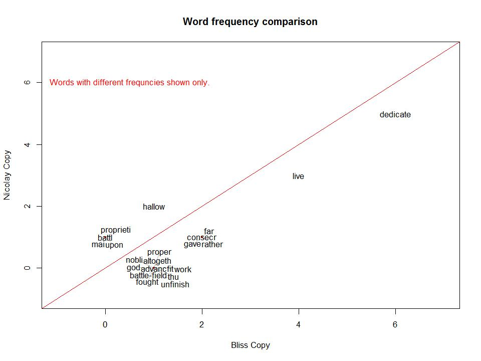

Homework 4: Text
==============================

| **Name**  | Kicho Yu  |
|----------:|:-------------|
| **Email** | kyu12@dons.usfca.edu |

## Instructions ##

The following packages must be installed prior to running this code:

- `devtools`
- `ggplot2`
- `reshape2`
- `scales`
- `tm`
- `wordcloud`


To run this code, please enter the following commands in R:

```
library(devtools)
source_url("https://raw.githubusercontent.com/excelsky/msan622/master/homework4/622_Visualization_HAG4.R")
```

This will generate 4 images and some text outputs. See below for details.


## Discussion ##

I chose a dataset of *The Gettysburg Address* by Abraham Lincoln. By then, there was no method to record his speech. So there were five different copies of his speech. All of these copies named after the people who received them: Bliss, Nicolay, Hay, Everett, and Bancroft. Those copies are slightly different among one another. Bliss' copy is considered the most standard. I found that Nicolay's copy is the most different from others and I will explain further later.  

I chose both **Option 1: Using GGPlot2** and **Option 2: Using WordCloud** to generate **three text visualizations**. Actually, I generated more than three text visualizations. I have **four text visualizations**.

First, I imported *The Gettysburg Address* from a website called [The Gettysburg Address](http://www.abrahamlincolnonline.org/lincoln/speeches/gettysburg.htm). I copied and pasted all the five versions and saved them into five *txt* files with *UTF-8* encoding.  

Then I used a `tm` package to munge data; to lower cases, remove punctuations, preserve intra word dashes, remove stop words, and strip white spaces. Then I created three versions based on stemming: no stemming, Porter stemming, and English stemming. I found that the latter two lead the same result and those results are more useful than the one from no stemming. For example, no stemming treats *dedicate* and *dedicated* differently, whereas those two stemming treat them the same. After reading all different versions of *The Gettysburg Address*, I found that it is better to treat those two words the same, because there is no significant different in their usages and I am more interested in a frequency of words. So I decided to use *Porter stemming* in my analysis and visualization.  

My lie factor, data-ink ratio, and data density are blah blah.

- **Plot 1: Word Cloud.**  
I followed one of the color rules; never use more colors than can be stored in short-term
memory. So I colored by types of genre and have them all hollow circles with `size=4` and `alpha=3/4`. I found that the higher the `alpha` is, the darker the color is. The `size` option calibrates the width of a line. I changed tick marks. The larger the `size` is, the thicker the line is. The smallest budget is $1,000 and the largest is $200 million.  
  

- **Plot 2: Comparison Cloud.**  
I played around the `colors()` and chose `tomato2`. Actually, there are `tomato` through `tomato4`. The higher the number is, the darker the color is. In other words, `tomato` is the lightest and `tomato4` is the darkest. I created my own data set to create this plot. This bar chart shows the count of genres in the `movies` data set. `Mixed` is the most common genre in this data set, whereas `Animation` is the least common.     
  

- **Plot 3: Small Multiples.**  
Similar to what I did to `hw1-scatter.png`, I used 'alpha=1/2' so that I could see the overlays of points. I changed the tick marks like I did in the first plot. Overall, I think four are 3 clusters in these 9 genres. `Documentary` and `Short` have low budget and have all ranges of ratings. `Animation` have a wide range of budget but has only a certain range of ratings. `Romance` has relatively high ratings and its budget is generally low. Other genres have a full range of budget and ratings.  
  

- **Plot 4: Frequency Plot.**  
I created my own tick marks so that I could see the lower and upper limit of the timeline. Actually, these data are not very good, because the four different European stock market indices are in one `price` without considering the currency. I created a long data format to create this plot by using `reshape2::melt()`. I created a box around a legend. Overall, Swiss SMI (Swiss Market Index) rises the most in the given period, whereas French CAC (Cotation Assistée en Continu) does the least.  

