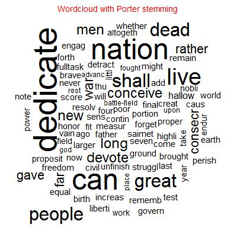

Homework 4: Text
==============================

| **Name**  | Kicho Yu  |
|----------:|:-------------|
| **Email** | kyu12@dons.usfca.edu |

## Instructions ##

The following packages must be installed prior to running this code:

- `devtools`
- `ggplot2`
- `reshape2`
- `scales`
- `tm`
- `wordcloud`


To run this code, please enter the following commands in R:

```
library(devtools)
source_url("https://raw.githubusercontent.com/excelsky/msan622/master/homework4/622_Visualization_HAG4.R")
```

This will generate 4 images and some text outputs. See below for details.


## Discussion ##

I chose a dataset of **The Gettysburg Address** by Abraham Lincoln. By then, there was no method to record his speech. So there were five different copies of his speech. All of these copies named after the people who received them: Bliss, Nicolay, Hay, Everett, and Bancroft. Those copies are slightly different among one another. Bliss' copy is considered the most standard. I found that Nicolay's copy is the most different from others and I will explain further later.  

I chose both **Option 1: Using GGPlot2** and **Option 2: Using WordCloud** to generate **three text visualizations**. Actually, I generated more than three text visualizations. I have **four text visualizations**.

First, I imported *The Gettysburg Address* from a website called [The Gettysburg Address](http://www.abrahamlincolnonline.org/lincoln/speeches/gettysburg.htm). I copied and pasted all the five versions and saved them into five *txt* files with *UTF-8* encoding.  

Then I used a `tm` package to munge data; to lower cases, remove punctuations, preserve intra word dashes, remove stop words, and strip white spaces. Then I created three versions based on stemming: no stemming, Porter stemming, and English stemming. I found that the latter two lead the same result and those results are more useful than the one from no stemming. For example, no stemming treats *dedicate* and *dedicated* differently, whereas those two stemming treat them the same. After reading all different versions of *The Gettysburg Address*, I found that it is better to treat those two words the same, because there is no significant different in their usages and I am more interested in a frequency of words. So I decided to use *Porter stemming* in my analysis and visualization.  


- **Plot 1: Word Cloud.**  

A word cloud shows an aggregate frequency among five different copies. In other words, it does not distinguish what copy a word is from.  

A size of a word implies its frequency. For example, *dedicate* is much bigger than *conceive* which are almost right below of *dedicate*. It means that *dedicate* is used much more in *The Gettysburg Address*. Indeed, *dedicate* is the most frequent word in this speech. After stemming via *Porter*, I changed *dedic* into *dedicate* in order to increase the readability. My top five frequent words are indeed **dedicate, can, nation, live,** and **dead**.  

A word cloud has an interesting lie factor. Even though a size of a word implies its frequency, human beings are not good at comparing exactly among 2 or 3 dimensional objects. So we only know a certain word is used more often than another one, but not precisely how much it is used more often. So lie factor in a word cloud is reasonable, but we, human beings, cannot tell exactly.  I think my word cloud has a reasonable lie factor.  

A word cloud shows all unique words. No words show up more than once. Therefore, a data-ink ratio is high. I think that so is my word cloud.  

A data density shows amount of data entries versus graphic area. I think my word cloud has more (white spaced) background than other typical word cloud. I happened to do it, because I wanted to have a title on top of the word cloud. Therefore, I think the data density in my word cloud is not very high.  

  


- **Plot 2: Comparison Cloud.**  

I was wondering the difference among the five copies. Thanks to Sophie, I found that a comparison cloud is a great tool to compare a word frequency among different sources. I simply used a `comparison.cloud()` function by feeding my data matrix and color specification. For some reason, I only see words from three different copies: *Brancroft, Hay,* and *Nicolay*.  

Like a word cloud, a size of a word implies its frequency in a comparison cloud. Therefore, we can easily tell that *hallow* is used much more often than *rest* in the Nicolay's copy of *The Gettysburg Address*.  

Yet, [word size is mapped to the difference between the rates that it occurs in each document.](http://blog.fellstat.com/?cat=11).  As seen from the comparison cloud, *battlefield, battle-field,* or at least *battl* which is a result from Porter stemming are used universally often in all three copies. For example, *god* which is actually *God* is only seen from *Bancroft*'s copy, at least from this comparison cloud.  

Like a word cloud, a lie factor in a comparison cloud is reasonable, but we, human beings, cannot tell exactly.  I think my comparison cloud has a reasonable lie factor.  

A comparison cloud shows all unique words per document. No words show up more than once per document. Therefore, a data-ink ratio is high. I think that so is my comparison cloud.  

My comparison cloud has more (white spaced) background than other typical word cloud, because for some reasons, I do not see any words from two out of five copies. Therefore, I think the data density in my word cloud is not very high.  

  


- **Plot 3: Small Multiples.**  

I looked at most frequent words among five copies. I found that *Nicolay*'s copy is perculiar. It has slightly lower frequency of using *dedicate* and *live*, even though they are two of the most frequently used words in a document. I thought a small multiples is a great plot to visually show this difference among five copies.  

In my small multiples, I highlighted the bars in *Nicolay*'s copy, because my goal was to distinguish it from others. I colored those bars in red, whereas did other bars in other copies grey. So I gave a color contrast. I increased the size of title, x-axis label, and y-axis label in order to increase a readability.  I highlighted the y-axis text in red for a higher readability.  

My lie factor, data-ink ratio, and data density are blah blah.  
  


- **Plot 4: Frequency Plot.**  
I created my own tick marks so that I could see the lower and upper limit of the timeline. Actually, these data are not very good, because the four different European stock market indices are in one `price` without considering the currency. I created a long data format to create this plot by using `reshape2::melt()`. I created a box around a legend. Overall, Swiss SMI (Swiss Market Index) rises the most in the given period, whereas French CAC (Cotation Assistée en Continu) does the least.  
My lie factor, data-ink ratio, and data density are blah blah.  

