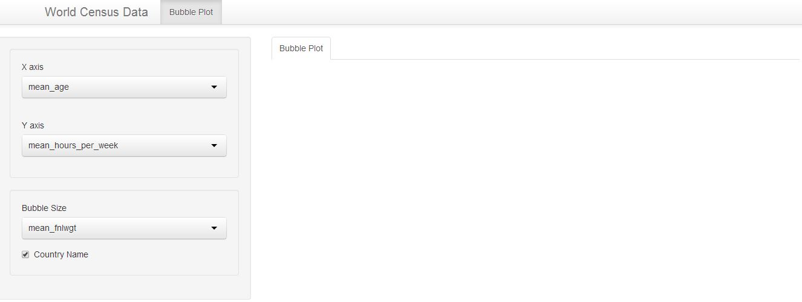
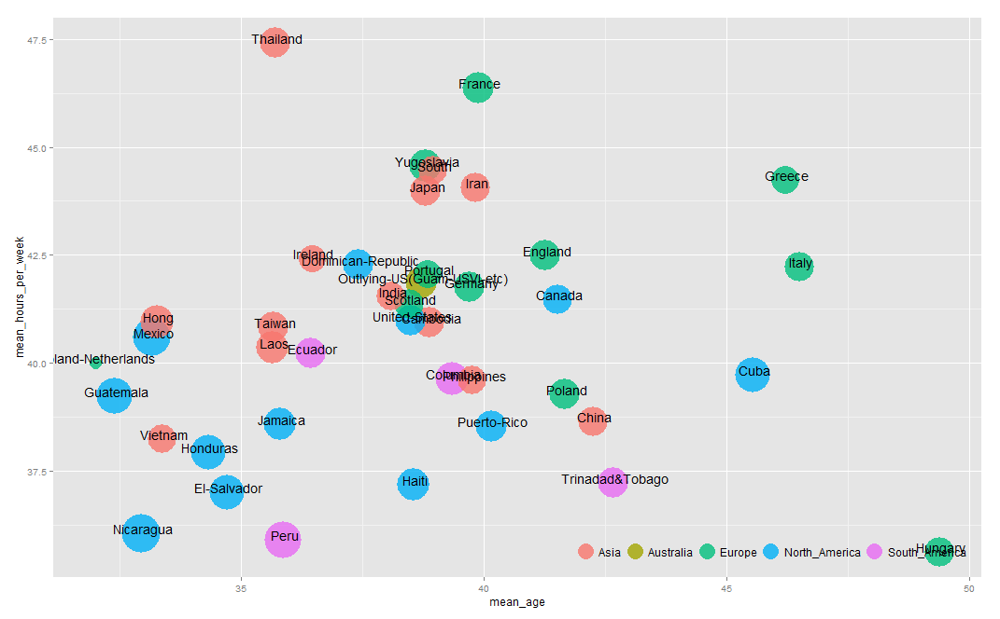
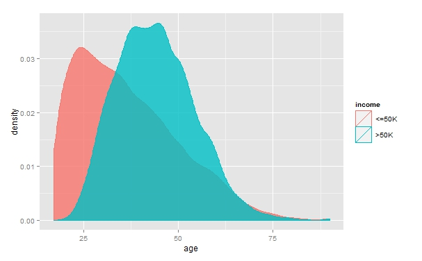

Project: Prototype
==============================

| **Name**  | Kicho Yu  |
|----------:|:-------------|
| **Email** | kyu12@dons.usfca.edu |

## Instructions ##

The following packages must be installed prior to running this code:
- `ggplot2`
- `plyr` 
- `RColorBrewer` 
- `reshape2` 
- `scales` 

To run this code, please enter the following commands in R:

```
library(shiny)
runGitHub("msan622", "excelsky", subdir = "project-prototype")
```
This will start the `shiny` app. See below for details on how to interact with the visualization.  


## Discussion ##
### Data ###
The dataset is called `adult.data` from [UCI Machine Learning Repository](https://archive.ics.uci.edu/ml/datasets/Adult). It is also called '1994 Census database.'  

As of data munging, I deleted rows that have NA's. In this case, the NA was coded as ' ?' which is different from '?'. It took a decent time for me to figure out the difference. The original dataset has 32561 rows and there are still 30162 rows left after this munging. Thus, this deletion technique is easier and much advisable than other techniques such as converting NA's into a categorical variable, as the data is preserved by 92%.


### Techniques ###

I have chosen the following visualization techniques for this prototype:

- Bubble Plot (Interactive - Not yet)
- Density Plot (Static)

 

#### Techniques 1: Bubble Plot (Interactive - Not yet) ####
It is supposed to be interactive, but somehow no plot is showing. So for this session, I will show my `ui.R` and actual plot separately.  

This bubble plot is for EDA: exploratory data analysis. I would like to see the demographic infomation out of the 30162 rows based on each country. Users can choose variables for the x-axis and the y-axis. They can change the size of bubbles. They can even opt in and out the name of the countries.  

As a next step, I am going to make sure this `shiny` plot is working properly. Then I will change the name of the variables in the left panel. I will increase the size of main plot and decrease the left panel. I will work on three evaluation criteria.

 


#### Techniques 2: Density Plot (Static) ####
This density plot shows the distinction in annual income: more than 50K USD versus less than or equal to 50K USD. In this specific screenshot, I ams shoing the income difference between ages. It is clear that the older the higher income. I am sure I can set up other numerical variables on the x-axis (instead of age) and make it interactive.

 
