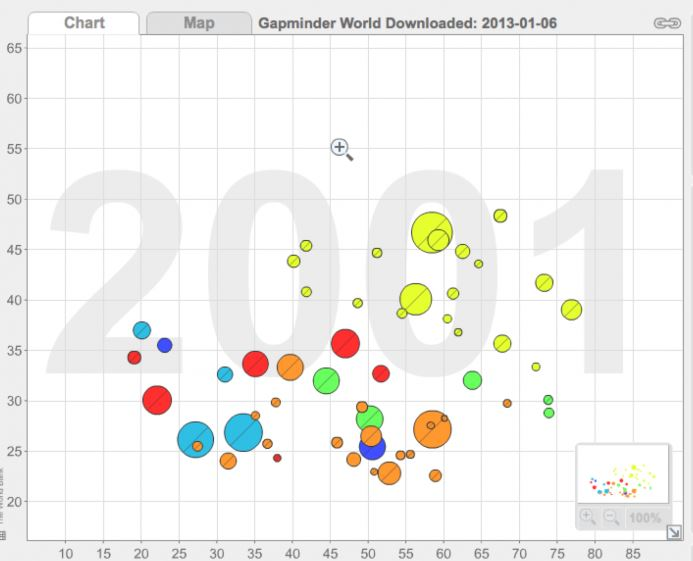
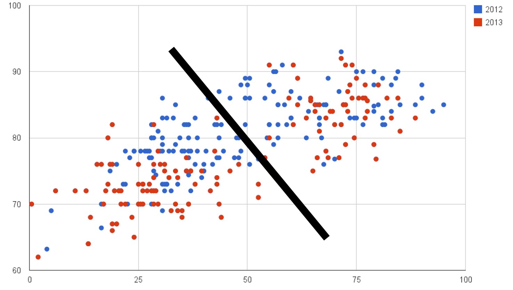

Project: Sketch
==============================

| **Name**  | Kicho Yu  |
|----------:|:-------------|
| **Email** | kyu12@dons.usfca.edu |

Planned Tools
------------------------------
My dataset is designed for a prediction task to determine whether a person makes over 50K a year. Instead of a prediction, I think I can visualize the characteristics of people who earns 50K or more versus less. 

My packages would be:
- `GGally `
- `ggplot2`
- `RColorBrewer`
- `scales`
- `shiny`
- `tm`

Planned Techniques
------------------------------
My plots are
- Bubble Chart
- Scatter Plot
- Paralell coordinates plot
- Heatmap

Include a list of four different techniques you plan to implement, why you choose those techniques for your dataset, and what you hope to learn. You should have approximately 3 to 5 sentences per technique.

Keep in mind you will be asked to implement 1 to 2 prototypes for peer review.

Planned Interaction
------------------------------

Describe the types of interaction you want to include (filtering, brushing, zooming, panning, sorting, and so on). You can discuss this per technique or overall if you plan to integrate all of the techniques into a single `shiny` app.

Keep in mind you will be asked to implement at least one of your planned interactions along with your prototype.

Planned Interface
------------------------------

#### Bubble Chart ####
I am not going to have exactly the same as Gapminder, but I will have a similar bubble chart. The bubbles represent countries and their size indicates the number of people from those countries in my dataset. I will have an interactive x- and y-axis. They will be two of the followings: average age, average final weight (I will explain what it is later at our final project), average years of education, and average hours-per-week.

#### Scatter Plot ####

#### blah ####

