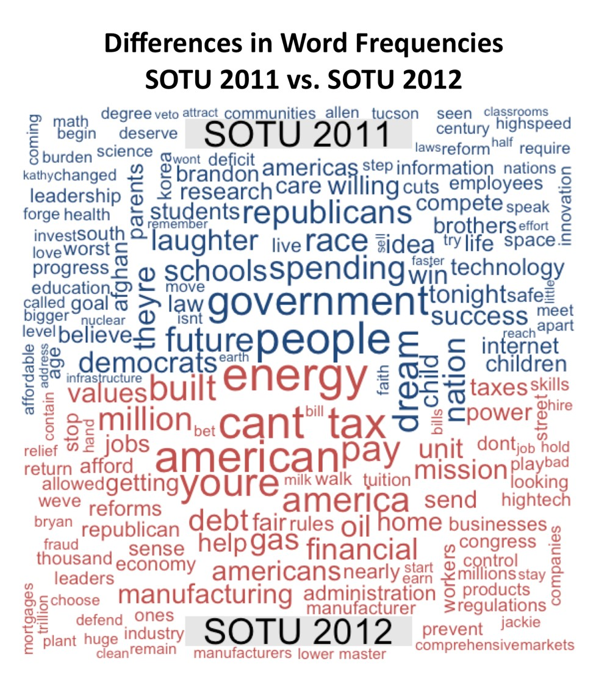
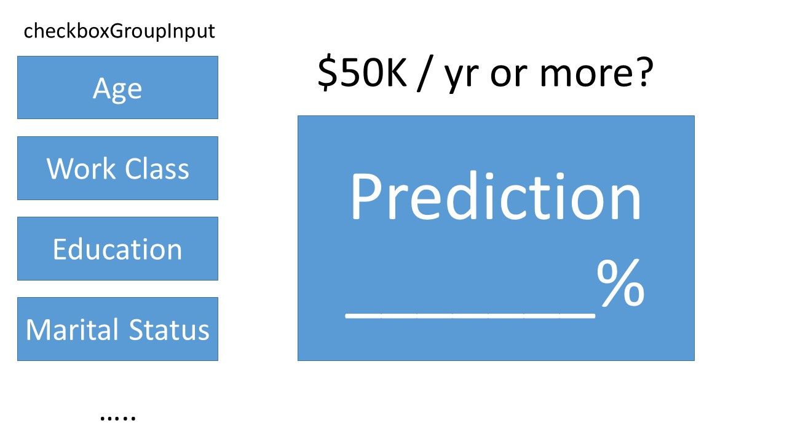

Project: Sketch
==============================

| **Name**  | Kicho Yu  |
|----------:|:-------------|
| **Email** | kyu12@dons.usfca.edu |

Planned Tools
------------------------------
My dataset is designed for a prediction task to determine whether a person makes over 50K a year. Instead of a prediction, I think I can visualize the characteristics of people who earn $50K or more versus less. 

My packages would be:
- `caret`
- `GGally `
- `ggplot2`
- `RColorBrewer`
- `reshape2`
- `scales`
- `shiny`
- `tm`
- `wordcloud`

Planned Techniques
------------------------------
My plots are
- Bubble Chart
- Scatter Plot
- Comparison Cloud
- Logistic Regression Interactivity

Include a list of four different techniques you plan to implement, why you choose those techniques for your dataset, and what you hope to learn. You should have approximately 3 to 5 sentences per technique.

Keep in mind you will be asked to implement 1 to 2 prototypes for peer review.

Planned Interaction
------------------------------

Zooming and filtering would be used for bubble chart and scatter plot.

Planned Interface
------------------------------

#### Bubble Chart ####
I am not going to have exactly the same as Gapminder, but I will have a similar bubble chart. The bubbles represent countries and their size indicates the number of people from those countries in my dataset. I will have an interactive x- and y-axis. They will be two of the followings: average age, average final weight (I will explain what it is later at our final project), average years of education, and average hours-per-week.  

#### Scatter Plot ####
I think it would be good to have scatter plot on numerical data. Users choose two variables on the left side and I show their scatter plot. Possibly, I show the segmentation within the elements.  

#### Comparison Cloud ####
I think it is useful to see a comparison cloud of job names between the two groups: those whose earn $50K or more versus less. My attached file is not exactly what I will have, but it will be similar.    

#### Logistic Regression Interactivity ####
I do not know a proper name of this page. I think it is not a plot per se, but I think this interactivity would be useful. I have a binary dependent variable: $50K / yr more or less. So I think it would be fun to users to click independent variables on the left side and see the prediction percentage on the right side. I may include a caution message there, saying that this page only shows a prediction without considering a model assumption such as no multicollearity and no normal distribution assumption on error terms.  

